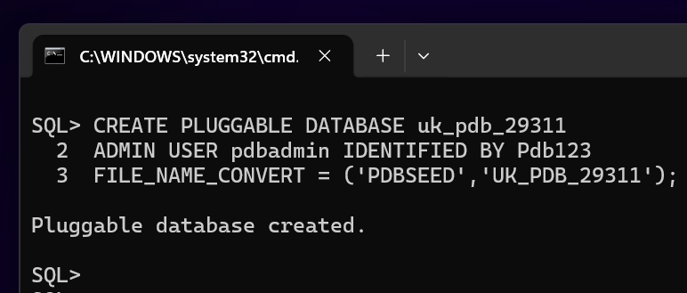
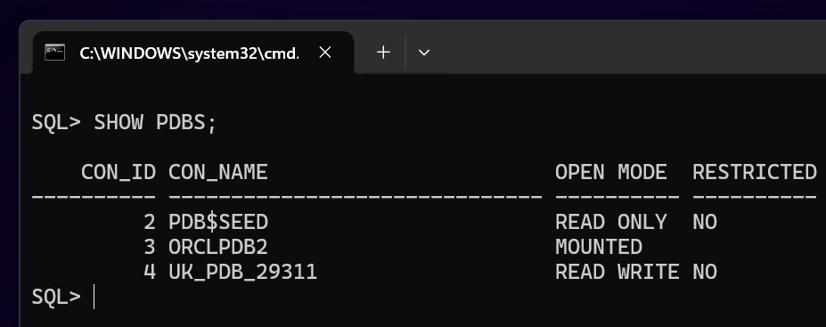
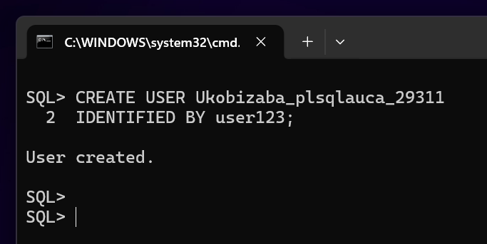
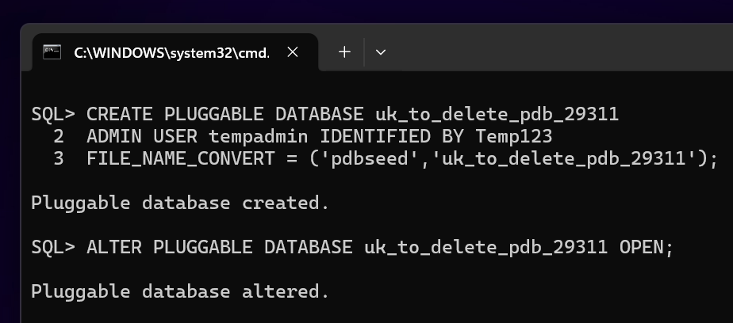
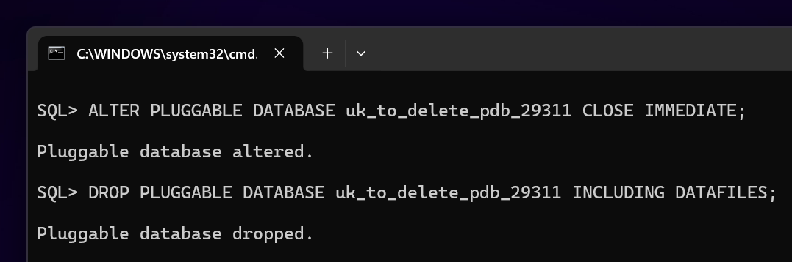
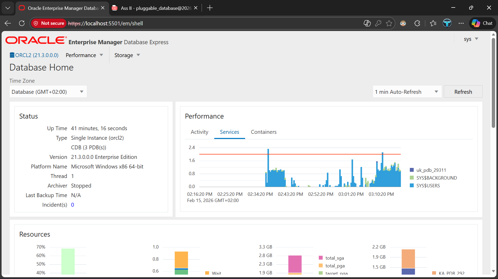

# Oracle Pluggable Databases Assignment II

### Database Development with PL/SQL (INSY 8311)

### My Information

- Name: UKOBIZABA Aimable
- Student ID: 29311

---

## Assignment Overview

This assignment demonstrates practical of Oracle Multitenant Architecture through the creation, management, and deletion of Pluggable Databases (PDBs). All database operations were executed using SQL\*Plus via the Command Line.

---

## Oracle Environment

- Operating System: Windows 11
- Oracle Version: Oracle Database 21c
- Tool Used: SQL\*Plus (CMD)
- Monitoring Tool: Oracle Enterprise Manager (OEM)

---

## Task 1: Create a New Pluggable Database

A new Pluggable Database was created from the CDB$ROOT container following the naming conventions as provided. The PDB was successfully opened in READ WRITE mode, and a dedicated user was created inside the PDB for future coursework.

### _Screenshots included:_

#### **PDB creation command and result**

#### **PDB Open State**

#### **User Created In PDB**

---

## Task 2: Create and Delete a Temporary PDB

A temporary Pluggable Database was created for testing purposes and then completely removed from the system, including its datafiles.

### _Screenshots included:_

#### **Temporary PDB creation**

#### **Temporary PDB deletion confirmation**

---

## Task 3: Oracle Enterprise Manager (OEM)

Oracle Enterprise Manager was configured and accessed successfully. The OEM dashboard reflects the Oracle environment and the completed PDB tasks.

### _Screenshot included:_

#### **OEM dashboard showing the created PDB**

---

## Challenges Encountered

No major issues were encountered during this assignment except for opening and logging in the OEM. All tasks were completed successfully by following Oracle documentation and course guidelines.

---

## Integrity Statement

I confirm that this work is entirely my own and that I did not copy commands, screenshots, or repositories from any other student or AI tool. All tasks were personally executed and documented in accordance with the academic integrity guidelines.
